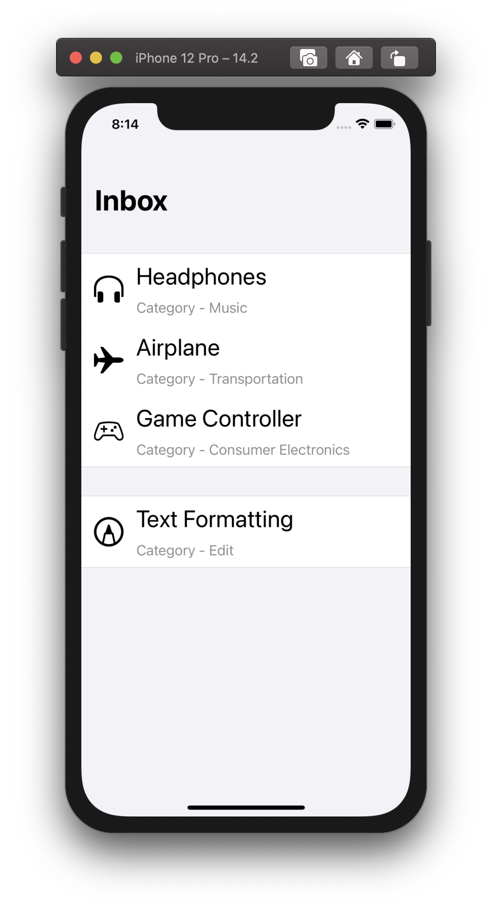
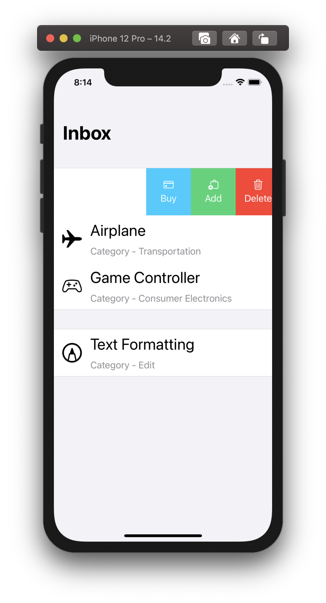
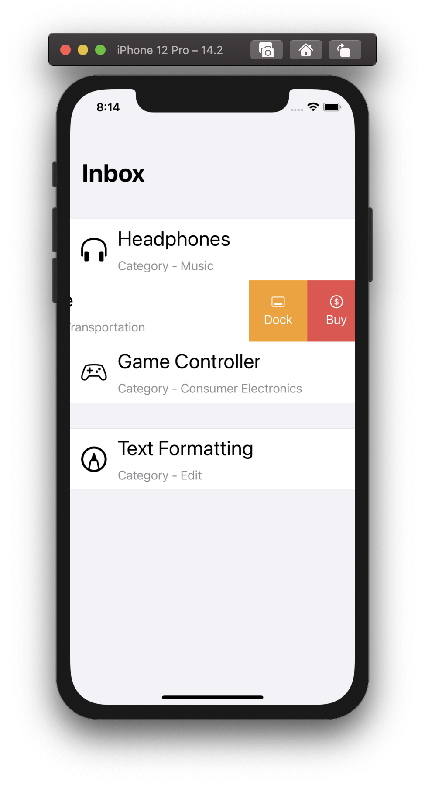
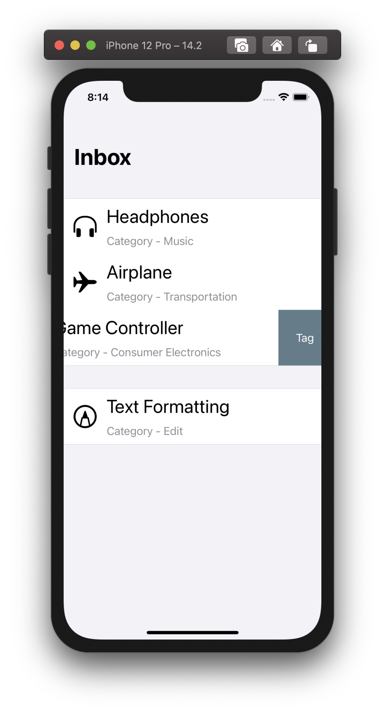

# SwipableContent
SwiftUI view that can be swiped to reveal contextual actions.

Home Screen

Three trailing contextual views with images and text

Two trailing contextual views with images and text

Two trailing contextual views with text

